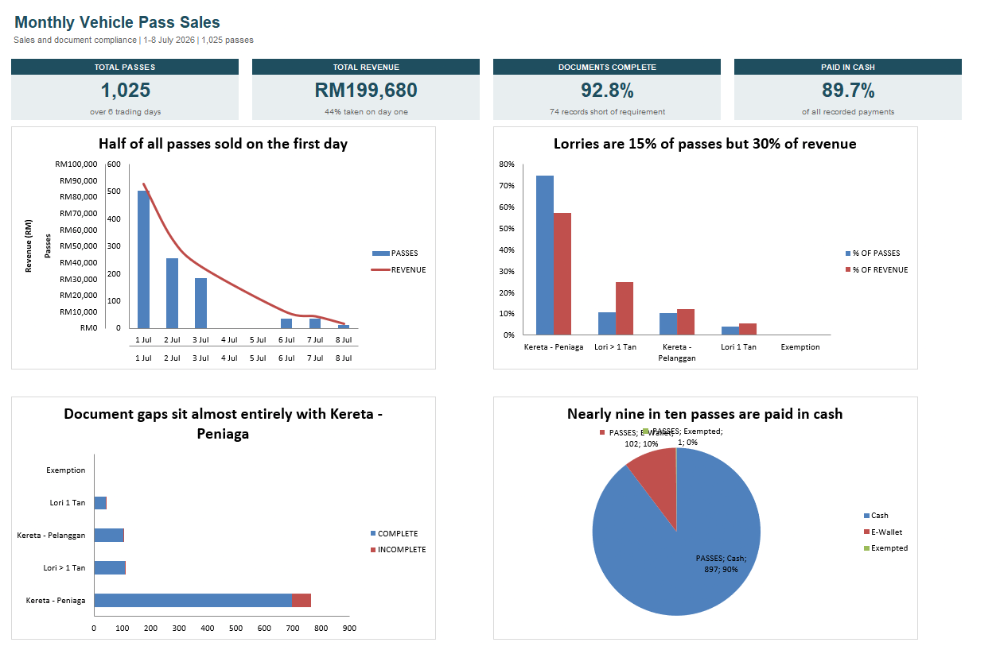

# Monthly Vehicle Pass Records: Data Entry, Cleaning & Analysis

Cleaning and analysing 1,025 monthly vehicle pass sales from a multi-tenant trading complex, from handwritten receipts through to a dashboard.

I was hired for data entry with some light analysis attached. I keyed the records in by hand, and when the job was nearly over I went back through what I'd typed and found it wasn't ready to be analysed. This repository is the before and the after.

**Headline:** RM199,680 across 1,025 passes over six trading days. Along the way I found that every date was stored in the wrong month, 20 passes were charged at the wrong rate, and roughly 140 repeat purchases had been made invisible by the way the file was anonymised.

---

## Contents

| File | What it is |
|---|---|
| [`data/01_raw_daily_records.xlsx`](data/01_raw_daily_records.xlsx) | The data as originally kept: one sheet per trading day, 1,021 records, every defect intact |
| [`data/02_cleaned_analysis_workbook.xlsx`](data/02_cleaned_analysis_workbook.xlsx) | Dashboard, analysis, cleaned master and unit occupancy |

Both files are anonymised. See [Privacy](#privacy). GitHub can't preview `.xlsx`, so download them to open.

---

## How it actually happened

**1. Manual entry.** Thousands of fields typed from physical receipts into one sheet per trading day, in Malay: `TARIKH`, `NO RESIT`, `NAMA`, `NO KAD PENGENALAN`, and so on. Six days: 1, 2, 3, 6, 7 and 8 July 2026.

**2. Combining.** On the last day I stacked the six daily sheets into a single master using `VSTACK` rather than copy-pasting by hand. It's repeatable, and it doesn't silently drop rows the way manual selection does.

**3. Cleaning.** This is where the work actually was. Details below.

**4. Analysis.** Category and daily revenue breakdowns, payment mix, document compliance, and unit-level occupancy, all built on live formulas so the numbers follow any edit to the source.

---

## What was wrong with the raw data

I keyed most of this in myself, so a fair share of these are my own mistakes. Finding them is the point.

### Every date was stored in the wrong month

I typed dates day-first, the way they're written in Malaysia: `1/7/2026` for 1 July. The file was set to read dates month-first, so Excel took that same text and stored 7 January 2026 instead. The cell still displayed `1/7/2026`, so nothing looked wrong on screen. Underneath, all 1,025 records were sitting in the wrong month, scattered across seven of them.

This is the difference between what a cell shows and what it holds. Any sort, filter or grouping by date would have used the stored value, so a monthly summary would have invented six months that never existed.

I found it because the dates stopped making sense as a set:

- Read **month-first**, the file claims sales on the 7th of January, February, March, June, July and August, with April and May missing for no reason.
- Read **day-first**, the same values become Wednesday 1, Thursday 2, Friday 3, Monday 6, Tuesday 7 and Wednesday 8 July.

The second reading is six consecutive trading days that skip Saturday and Sunday. A site that closes at weekends explains that gap. Six scattered months explain nothing. The daily sheet tabs were also named `172026`, `272026` and so on, which is day-first, and that confirmed it independently.

The fix was to swap day and month across every record.

### 20 passes were charged at the wrong rate

Rates are fixed per vehicle category, but 20 records disagreed with their own category: trader cars billed at RM450, lorries at RM150. Raw revenue as actually priced was RM198,770 against RM199,680 once reconciled, a **RM910 gap**.

I flagged these rather than silently fixing them, because the correction runs both ways. If the price is right and the category was mistyped, revenue was correct all along. Deciding which needs the physical receipts, not a spreadsheet.

### `"E-Wallet "` with a trailing space

87 entries had the space, 15 didn't. Excel treated them as two separate payment methods, so every pivot table split e-wallet revenue across two rows and understated it. A second variant had three *leading* spaces. Invisible on screen, and the sort of thing that quietly corrupts a report.

### Receipt numbers aren't unique

117 duplicates, 67 of them within a single day, ranging from 1 to 16,775 with large gaps in between. That's consistent with several receipt books running at different counters at the same time, which means receipt number alone can't be a primary key here. It needs book plus number. 48 records had no receipt number at all, and 131 were stored as text with leading zeros alongside numeric ones.

### Blank cells meaning different things

Unit number was blank on 42 records, `-` on 33, and `N/A` on 3. These aren't missing data. The intake form for those vehicle types never asked for a unit number. Treating them as gaps would have inflated the missing-data rate by 7 percentage points and pointed at a problem that doesn't exist.

### Record count mismatch

1,021 records across the daily sheets against 1,025 in the master. Four records in the master have no counterpart in the source, and four rows carry no date at all. This one is unresolved, and documented rather than quietly reconciled.

---

## Cleaning decisions

Each rule below was confirmed with the people who collect the data, not inferred from the values.

| Issue | Decision |
|---|---|
| Transposed dates | Swapped day and month across all records, verified against the weekday pattern and the tab names |
| Two records dated 1/8 | Corrected to 1 July. They sat inside the 1 July block, and 1 August is a Saturday |
| Duplicate `BIL` | One hardcoded value broke the sequence, so I restored the formula and it runs 1 to 1025 |
| Whitespace | Trimmed across all text fields |
| Prices as text | Converted to numbers driven by a lookup against a documented rate table |
| Blank, `-` and `N/A` unit numbers | Normalised to a single "not provided" state, not counted as missing |
| Two units in one cell | Split into separate columns, one row per pass. Splitting into rows would double-count revenue |
| Missing receipts | Flagged separately. Percentages report against recorded payments only, but the revenue still counts |

**Document compliance is category-dependent**, which took a few passes to get right. Trader cars must supply a full document set. Every other category needs only an IC, or any other document that traces back to the holder, such as a lorry grant. The same status can therefore be compliant on one row and non-compliant on another, so a single global rule would have been wrong in both directions.

---

## Findings

**Sales collapse after opening day.** 502 of 1,025 passes sold on 1 July, falling to 13 by 8 July. Day one took 49% of passes but only 44% of revenue, because it skewed toward RM150 trader cars while the higher-value lorries came in later.

**Lorries are 15% of passes but 30% of revenue.** Trader vehicles dominate volume at 74.5% yet contribute 57% of revenue. Volume and value point in different directions here.

**Compliance is a single-category problem.** 92.8% of records are complete, and 68 of the 74 shortfalls are trader cars, the only category required to produce a full document set.

**Nearly nine in ten passes are paid in cash**, which is an operational and reconciliation risk as much as a statistic.

**Around 140 passes are repeat purchases.** 874 distinct IC numbers across 1,014 records that have one. 103 holders bought more than once, and one bought seven times. This is worth dwelling on: the first pass at anonymising the file assigned placeholder codes row by row, so every record looked like a different person and the repeat structure vanished completely. The dataset isn't "1,025 passes". It's roughly 880 customers, some buying for several vehicles, which is a different business question.

---

## Privacy

The raw records contained real names, Malaysian NRIC numbers, phone numbers, company names and vehicle plates for over a thousand people. **None of that is in this repository.**

Identities were replaced with placeholders, mapped consistently so the same person keeps the same code across every sheet. Repeat purchases survive, re-identification doesn't. Blanks stay blank, and NRIC and passport holders remain distinguishable. Document metadata was scrubbed, and the file was scanned at the XML level to confirm nothing survived in cached form.

Every data-quality defect described above is preserved deliberately in the raw sample. None of it is an artefact of anonymisation.

---

## Tools

Excel: `VSTACK`, `INDEX`/`MATCH`, `SUMIFS`/`COUNTIFS`, dynamic arrays, data validation, pivot tables and charts.

Summary tables are formula-driven rather than static pivots, so the workbook stays correct when the underlying data changes.

---

## Use of this material

The analysis, documentation and workbook structure in this repository are my own work, shared for portfolio purposes. The underlying records come from a completed engagement and are published here in anonymised form only. Please ask before reusing the data or the workbooks.
